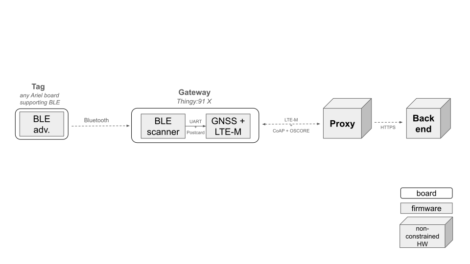
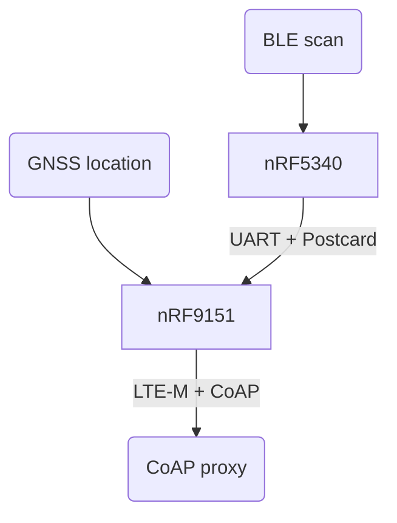

# Mobile Asset Tracker

This open source project contains multiple Ariel OS applications capable of being executed on the Nordic Thingy91: X prototyping platform. Combined, these functionalities constitute a miniature BLE sniffer prototype running on battery, reporting periodically its geographical position and the Bluetooth scan results using the cellular network.

More specifically, the features aggregated in this demonstrator include:

- Scanning the nearby bluetooth devices,
- Filtering the devices having a `CompleteLocalName` starting with a predetermine prefix,
- Perform periodic GPS geolocation,
- Periodically transmit the list of recently detected devices and the GPS position of the Thingy:91 X using the LTE-M network.
- Using the encrypted CoAP protocol and CBOR encoding to secure and limit the amount of data sent on the LTE-M link.

As an accompaniment, the code provides a sample application in Python executable on a computer, containing a proxy prototype that manages the CoAP exchange, CBOR decoding on the one hand, and the sending of the data in JSON format to a backend (HTTPS server) for data collection on the other.

## Remarks / Future Work

- The BLE scan is basic and could be improved (e.g. adding security, implementing the iBeacon standard, ...). This aspect could be addressed at a later stage.
- The power consumption of the firmwares running on the Thingy:91 X is not optimized in the current state. This could be adressed in a second phase.
- The battery level currently reported by the Thingy:91 X firmware is fake/mocked. This could be adressed in a second phase.
- Timestamp: an improvement could be to not send any update about the scaned devices until a new GPS fix is obtained (and the corresponding timestamp).
- Authentication: currently the gateway is not authenticated by the proxy, nor the backend. Adding this authentication could happen in a second phase.
- Storage: an improvement could be to add a way to store an history of the measurements in the event the LTE-M network is not available.
- Gateway identifier: for now it's a string representation of its MAC. This format could be improved.



## Firmware Architecture



### nRF5340 Network core

`net/` directory.

The network core of the nRF5340 MCU is scanning for BLE packets and sending them to the nRF9151 SiP using UART (VCOM1).

One task scans for BLE advertisement packets and store them in a list.  
The second task reads this list and writes it into the UART channel every 2 seconds. Using `postcard` encoding and applying `COBS` on top. Once the data is sent the list of scanned devices is cleared.

### nRF5340 Application core

`app/` directory.

The only role of the application core is to initialize the peripherals and start the network core.

### nRF9151

`gateway/` directory.

This chip is used to get the location of the board using GNSS and communicate using LTE-M.

It is responsible for aggregating the information and sending it to the server.

- A first task reads the UART (VCOM1) channel, decodes and stores the BLE devices listed by the nRF5340.
- A second task fetches the new position (latitude, longitude and altitude) reported by the GNSS sensor (new value approximately every second). If the position returned is valid it will be saved in a shared variable as the last know position.
- The third task sets up LTE-M networking and pings the CoAP proxy when new updates are available.
- A fourth task handles the CoAP requests.

### The proxy

In `coap-proxy` is an example of simple "Resource Directory" where the devices can register themselves to. This server will then use the NAT port mapping created by the initial request of the gateway to send requests to it. This proxy will then send requests to the gateway to query its current status.

The communication is encrypted using `OSCORE` and `EDHOC` is used to establish and exchange the keys. The gateway checks the authenticity of the server as it knows its public key, but the server cannot yet validate the authenticity of the gateway.

### Extras

- `common-types` contains the types that are sent through communication channels (UART, networking) and so are used in two programs.
- `reader` is a test application that reads the data sent through `UART` from the `net` application.
- `coap-tests` is used to test coap connection without having to use the Thingy:91 X and cellular network.

## Setup

### Flashing

We need to flash both cores of the nRF5340 and the nRF9151.

On the Thingy91X you will need to connect an external programmer through P8 or P9, provide power via the USB-C connector (J6), ensure the power switch (SW1) is in the "ON" position.

#### Network core

Set the SWD switch (SW2) to the "nRF53" posistion.

```sh
cd net
laze build -b nrf5340dk-net run
```

> If probe-rs complains about the core being locked up, add `-- --allow-erase-all` at the end of the command:
>
> ```sh
> laze build -b nrf5340dk-net run -- --allow-erase-all
> ```

Once you see that the program is started (showing `INFO` lines with the text `scanning...`) you can close the debugging session by pressing `ctrl + C` or closing the terminal.

#### Application core

Set the SWD switch (SW2) to the "nRF53" posistion.

```sh
cd app
laze build -b nrf5340dk run
```

### Proxy

Follow the guide in [coap-proxy](coap-proxy/Readme.md)

#### nRF9151

You need to set the public key of the proxy you deployed during the previous step in `gateway/peers.yml` (field kccs).

Set the SWD switch (SW2) to the "nRF91" posistion.

```sh
cd gateway
COAP_ENDPOINT=<endpoint> laze build -b nordic-thingy-91-x-nrf9151 run
```

Replace `<endpoint>` with the IP and port of the CoAP proxy (ex: `1.2.3.4:4230`).

## Usage

### LED status

There is an RGB led on the Thingy91X, for now each color (red, green, blue) is used as individual LEDs to represent the status of different components.

- Red: first GNSS fix hasn't been acquired yet (location unknown)
- Blue: last data returned by the GNSS module was a valid location (updates every second)
- Green: sending update to the server using LTE-M.

Since those 3 colors are in the same package, two concurrent statuses can make different colors.

### Input

The top button can be pressed to force an ping to be sent to the proxy before the 360 seconds wait.
