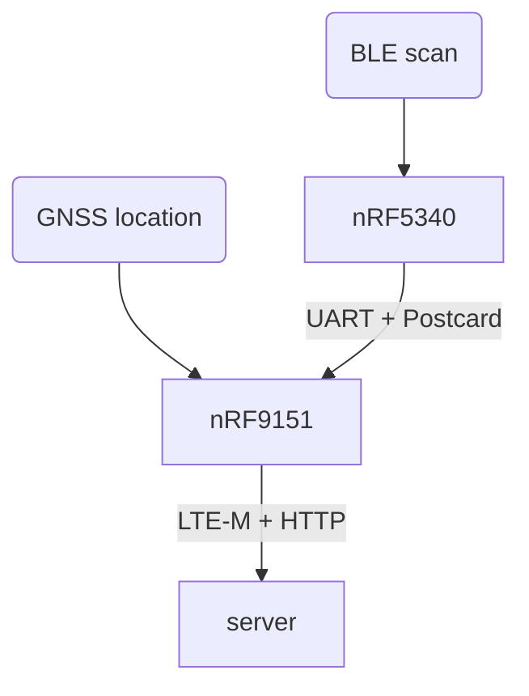

# BLE scan gateway

This repository is a poof of concept showing how we can report the presence of BLE tags in the proximity of a MCU.

This version is using the Thingy91X development kit.

## Architecture



### nRF5340 Network core

`net/` directory.

The network core of the nRF5340 MCU is scanning for BLE packets and sending them to the nRF9151 SiP using UART (VCOM1).

One task scans for BLE advertisement packets and store them in a list.  
The second task reads this list and writes it into the UART channel every 2 seconds. Using `postcard` encoding and applying `COBS` on top. Once the data is sent the list of scanned devices is cleared.

### nRF5340 Application core

`app/` directory.

The application core is not used in this project. It is only used to initialize the peripherals and start the network core.

### nRF9151

`gateway/` directory.

This chip is used to get the location of the board using GNSS and communicate using LTE-M.

It is responsible for aggregating the information and sending it to the server.

- A first task reads the UART (VCOM1) channel, decodes and stores the BLE devices listed by the nRF5340, a timestamp is attached to each address to record when it was last seen.
- The second task deletes addresses that have a timestamp older than 10 minutes. This removes devices that havent been detected for too long (out of range).
- A third task fetches the new position (latitude, longitude and altitude) reported by the GNSS sensor (new value approximately every second). If the position returned is valid it will be saved in a shared variable as the last know position.
- The fourth task sets up LTE-M networking and registers the device to the CoAP resource directory server.
- Finally a task handles the CoAP requests.

### The server

In `coap-server` is an example of simple "Resource Directory" where the devices can register themselves to. This server will then use the NAT port mapping created by the initial request of the gateway to send requests to it. This "server" will then send requests to the gateway to query its current status.

The communication is encrypted using `OSCORE` and `EDHOC` is used to establish and exchange the keys. The gateway verifies the authenticity of the server as it knows its public key, but the server cannot yet verify the authenticity of the gateway.

### Extras

- `common-types` contains the types that are sent through communication channels (UART, networking) and so are used in two programs.
- `reader` is a test application that reads the data sent through `UART` from the `net` application.
- `coap-tests` is used to test coap connection without having to use the Thingy:91 X and cellular network.

## Setup

### Flashing

We need to flash both cores of the nRF5340 and the nRF9151.

On the Thingy91X you will need to connect an external programmer through P8 or P9, provide power via the USB-C connector (J6), ensure the power switch (SW1) is in the "ON" position.

#### Network core

Set the SWD switch (SW2) to the "nRF53" posistion.

```sh
cd net
laze build -b nrf5340dk-net run
```

> If probe-rs complains about the core being locked up, add `-- --allow-erase-all` at the end of the command:
>
> ```sh
> laze build -b nrf5340dk-net run -- --allow-erase-all
> ```

Once you see that the program is started (showing `INFO` lines with the text `scanning...`) you can close the debugging session by pressing `ctrl + C` or closing the terminal.

#### Application core

Set the SWD switch (SW2) to the "nRF53" posistion.

```sh
cd app
laze build -b nrf5340dk run
```

#### nRF9151

Set the SWD switch (SW2) to the "nRF91" posistion.

```sh
cd gateway
BACKEND_ENDPOINT=<endpoint> laze build -b nordic-thingy-91-x-nrf9151 run
```

Replace `<endpoint>` with the URL of the endpoint (ex: `http://example.com:4500/mac`).

### Server

To receive the requests of the device and see its content you can use the sample web server, to run it do:

```sh
cd server
cargo run --release
```

New reports will appear like this (here the GNSS location was not obtained yet):

```log
Received update at 2025-10-07T14:19:29.882282308+02:00
Time of fix: None
Position: None
Altitude: None
Number of MAC addresses: 10
DE:3F:A6:0C:47:EC
CA:39:3F:DA:C3:6F
67:E0:A2:D3:69:4F
7A:3A:48:34:A6:E4
B2:21:7B:7E:C7:4D
DE:72:F4:4E:12:4F
E3:C7:71:84:B4:5A
B9:01:2B:8D:1F:4A
E4:93:47:2D:0D:94
F6:47:47:E4:22:6B
```

## Usage

### LED status

There is an RGB led on the Thingy91X, for now each color (red, green, blue) is used as individual LEDs to represent the status of different components.

- Red: first GNSS fix hasn't been acquired yet (location unknown)
<!-- 
- Blue: last data returned by the GNSS module was a valid location (updates every second)
- Green: sending update to the server using LTE-M.
 -->

Since those 3 colors are in the same package, two concurrent statuses can make different colors.

### Input

The top button can be pressed to force an update to be sent before the 60 seconds have been elapsed.
